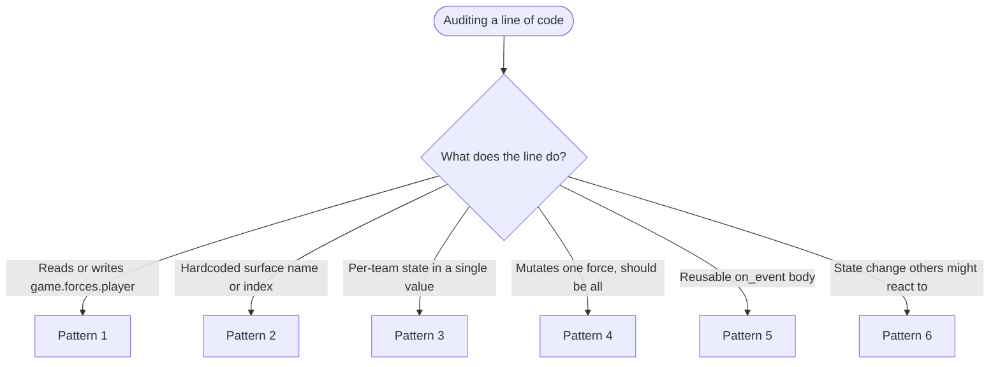
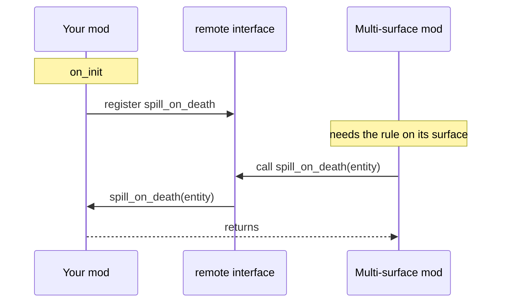
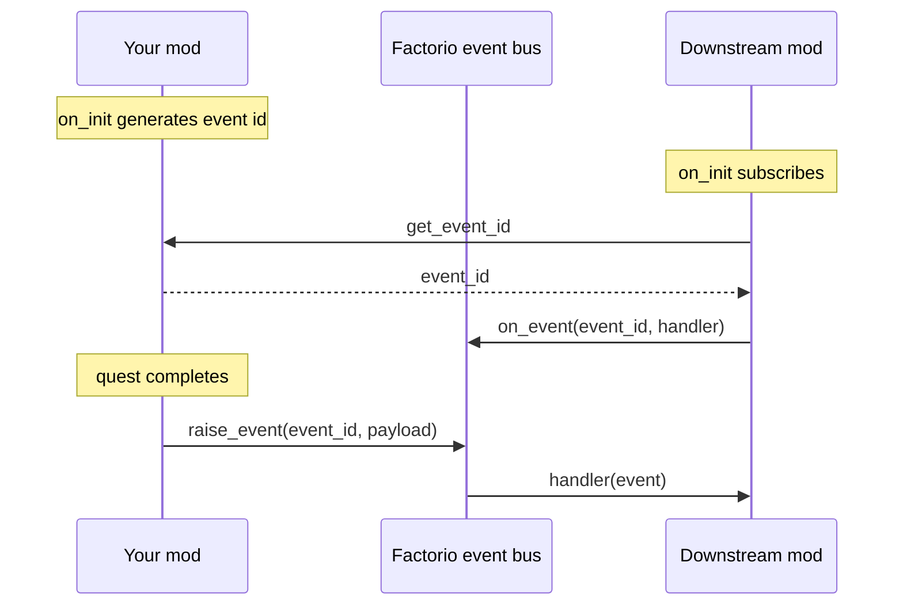

# Writing Mods for Multi-Force Environments

A short guide for Factorio mod authors who want their mod to keep working when more than one player force exists, or more than one planet-like surface exists. PvP scenarios, team-vs-team modes, per-team-surface setups, and even some single-player overhauls all qualify.

Most mods are written assuming the vanilla setup: one player force named `"player"`, one starting surface called `"nauvis"`. That's fine for vanilla play, but a few small habits break the moment a player or scenario adds extra forces or extra surfaces. This page lists the common pitfalls and the cheap fixes.

## Mental model

Vanilla gives you `game.forces.player` and `game.surfaces.nauvis` by default. Treat both as **examples of a kind**, not as singletons:

- Other player-controlled forces can exist (any team scenario, PvP mod, console commands).
- Other planet-class surfaces can exist (Space Age planets, mod-added planets, scenario-created copies of nauvis).
- A player can switch forces during a game.
- A single force can have players spread across many surfaces.

If your code says "the player force" or "nauvis" by name, ask whether you actually meant **the acting force** or **the planet nauvis** — they're often different things.

Each pattern below shows the pitfall code, why it breaks, and a fix that's a direct rewrite of the same code. Copy whichever shape matches yours.

## Which pattern do I need?



- **Pattern 1** — [Don't hardcode `game.forces.player`](#pattern-1-dont-hardcode-gameforcesplayer)
- **Pattern 2** — [Don't hardcode surface names or indices](#pattern-2-dont-hardcode-surface-names-or-indices)
- **Pattern 3** — [Key persistent state by force (and by surface)](#pattern-3-key-persistent-state-by-force-and-by-surface)
- **Pattern 4** — [Iterate, don't assume singular](#pattern-4-iterate-dont-assume-singular)
- **Pattern 5** — [Expose runtime rules so other mods can reuse them](#pattern-5-expose-runtime-rules-so-other-mods-can-reuse-them)
- **Pattern 6** — [Emit events for lifecycle hooks](#pattern-6-emit-events-for-lifecycle-hooks)

More than one branch may apply to the same line — e.g. a `storage.points[1]` write that *also* assumes the default force can need both Pattern 2 and Pattern 3. In that case, apply both.

---

## Pattern 1: Don't hardcode `game.forces.player`

### Example 1 — Granting a buff after a quest completes

**Pitfall:**

```lua
local function complete_quest(player)
    game.forces.player.manual_mining_speed_modifier =
        game.forces.player.manual_mining_speed_modifier + 0.25
    game.forces.player.print("Quest complete! +25% mining speed.")
end
```

The player who finished the quest is probably on a team force, not the default `"player"` force. The buff lands on an empty force; the print goes to nobody.

**Fix:**

```lua
local function complete_quest(player)
    local force = player.force
    force.manual_mining_speed_modifier =
        force.manual_mining_speed_modifier + 0.25
    force.print("Quest complete! +25% mining speed.")
end
```

Use `player.force` — the force that actually earned the reward. Everyone on that team gets the buff and the announcement; everyone on other teams is correctly excluded.

### Example 2 — Gating a trade behind research

**Pitfall:**

```lua
local function can_trade(recipe_name)
    return game.forces.player.recipes[recipe_name].researched
end

script.on_event(defines.events.on_gui_click, function(event)
    if event.element.name == "trade-belt-button" then
        if can_trade("express-belt") then
            execute_trade(event.player_index, "express-belt")
        end
    end
end)
```

The check reads the default force's research, not the clicker's. Teams that already researched express belts get told "no", teams that haven't but where the default force has, get a free pass.

**Fix:**

```lua
local function can_trade(force, recipe_name)
    return force.recipes[recipe_name].researched
end

script.on_event(defines.events.on_gui_click, function(event)
    if event.element.name == "trade-belt-button" then
        local player = game.get_player(event.player_index)
        if can_trade(player.force, "express-belt") then
            execute_trade(event.player_index, "express-belt")
        end
    end
end)
```

The check follows the clicker's force, so each team's trade catalog reflects its own progress.

---

## Pattern 2: Don't hardcode surface names or indices

### Example 1 — Filtering an event handler to "the planet nauvis"

**Pitfall:**

```lua
script.on_event(defines.events.on_built_entity, function(event)
    local entity = event.created_entity
    if entity.surface.name ~= "nauvis" then return end
    if entity.name == "boiler" then
        block_build_with_message(event.player_index, "Boilers banned on Nauvis.")
        entity.destroy()
    end
end)
```

A scenario or multi-surface mod may create extra surfaces that still belong to the nauvis planet (`team-3-nauvis`, `mts-nauvis-3`). The literal-name check rejects all of them, so the rule never fires on those copies and players can build banned items there.

**Fix:**

```lua
script.on_event(defines.events.on_built_entity, function(event)
    local entity = event.created_entity
    if not (entity.surface.planet
            and entity.surface.planet.name == "nauvis") then return end
    if entity.name == "boiler" then
        block_build_with_message(event.player_index, "Boilers banned on Nauvis.")
        entity.destroy()
    end
end)
```

`surface.planet.name` identifies the planet itself, not the surface, so the rule fires on every surface that belongs to that planet — including scenario-created copies of nauvis. Skips space platforms automatically (their `planet` is nil). Note that a separate planet prototype derived from nauvis (e.g. a mod that adds a `nauvis-remix` planet) has its own name and won't match — if you want the rule to cover those too, list them explicitly or check against a set of planet names you maintain.

### Example 2 — Per-surface tint storage

**Pitfall:**

```lua
script.on_init(function()
    storage.tints = {
        [1]  = settings.global["my-mod-nauvis-color"].value,
        [-1] = settings.global["my-mod-space-color"].value,
    }
end)

local function render_chunk(surface, chunk)
    rendering.draw_rectangle{
        color    = storage.tints[surface.index],
        left_top = chunk.area.left_top,
        right_bottom = chunk.area.right_bottom,
        surface  = surface,
    }
end
```

Surface indices are not assigned in a guaranteed order. Another mod creating a surface earlier in load shifts everything — `storage.tints[1]` may not be nauvis. Custom surfaces fall through to `nil` and crash the render call.

**Fix:**

```lua
local DEFAULT_TINT = { r = 0.5, g = 0.5, b = 0.5 }

local function tint_for(surface)
    local planet = surface.planet and surface.planet.name or "space"
    local setting = settings.global["my-mod-" .. planet .. "-color"]
    return setting and setting.value or DEFAULT_TINT
end

script.on_init(function()
    storage.tints = {}
    for _, surface in pairs(game.surfaces) do
        storage.tints[surface.index] = tint_for(surface)
    end
end)

script.on_event(defines.events.on_surface_created, function(event)
    local surface = game.surfaces[event.surface_index]
    storage.tints[surface.index] = tint_for(surface)
end)

local function render_chunk(surface, chunk)
    rendering.draw_rectangle{
        color    = storage.tints[surface.index] or DEFAULT_TINT,
        left_top = chunk.area.left_top,
        right_bottom = chunk.area.right_bottom,
        surface  = surface,
    }
end
```

Tint is derived from the *current* surface's planet kind, populated as surfaces appear, and read by the actual current index — no guesses, and unknown surfaces fall back safely instead of crashing.

---

## Pattern 3: Key persistent state by force (and by surface)

### Example 1 — A team score counter

**Pitfall:**

```lua
script.on_init(function()
    storage.points = 0
end)

local function award_points(player, n)
    storage.points = storage.points + n
    player.print("Total points: " .. storage.points)
end
```

One shared counter. Every team contributes to the same number, so the "score" reflects everyone's combined activity rather than any one team's progress.

**Fix:**

```lua
script.on_init(function()
    storage.points = {}
    for _, force in pairs(game.forces) do
        storage.points[force.index] = 0
    end
end)

script.on_event(defines.events.on_force_created, function(event)
    storage.points[event.force.index] = 0
end)

local function award_points(player, n)
    local idx = player.force.index
    storage.points[idx] = (storage.points[idx] or 0) + n
    player.print("Total points: " .. storage.points[idx])
end
```

Each force gets its own counter, initialized when the force appears and read off the acting player's force.

### Example 2 — Per-surface chunk ownership

**Pitfall:**

```lua
script.on_init(function()
    storage.claimed = {}  -- claimed[chunk_key] = force_name
end)

local function claim_chunk(force, surface, chunk_key)
    storage.claimed[chunk_key] = force.name
end

local function owner_of(chunk_key)
    return storage.claimed[chunk_key]
end
```

The same chunk key collides across surfaces — claiming `(0,0)` on Vulcanus overwrites whatever claim exists at `(0,0)` on Nauvis. A force on one planet can "steal" another force's chunk on a different planet without ever visiting it.

**Fix:**

```lua
script.on_init(function()
    storage.claimed = {}  -- claimed[surface_index][chunk_key] = force_name
end)

script.on_event(defines.events.on_surface_created, function(event)
    storage.claimed[event.surface_index] = {}
end)

local function claim_chunk(force, surface, chunk_key)
    storage.claimed[surface.index] = storage.claimed[surface.index] or {}
    storage.claimed[surface.index][chunk_key] = force.name
end

local function owner_of(surface, chunk_key)
    return (storage.claimed[surface.index] or {})[chunk_key]
end
```

Two levels of indexing — surface, then chunk — keep each planet's claims independent. The lookup also takes the surface, so callers can't accidentally drop it.

---

## Pattern 4: Iterate, don't assume singular

### Example 1 — Resetting technology effects after a balance change

**Pitfall:**

```lua
script.on_configuration_changed(function()
    game.forces.player.reset_technology_effects()
end)
```

Only the default force gets the recalculation. Team forces keep stale modifiers from the previous mod version — their effective bonuses now drift away from what the new tech tree describes.

**Fix:**

```lua
script.on_configuration_changed(function()
    for _, force in pairs(game.forces) do
        force.reset_technology_effects()
    end
end)
```

Every force gets the recalculation, including enemy and neutral — some mods put research on those forces (for example, evolution-scaled enemy bonuses), so skipping them would leave their modifiers stale too. Vanilla single-force games still work (the loop runs once); multi-force games stay consistent.

### Example 2 — Refreshing a per-player GUI when a team value changes

**Pitfall:**

```lua
local function refresh_score_gui(force)
    for _, player in pairs(game.players) do
        if player.force == force then
            local frame = player.gui.screen.score
            if frame then
                frame.caption = "Score: " .. storage.points[force.index]
            end
        end
    end
end
```

Works, but it's `O(all players)` and easy to forget the `if`. In a 50-player game updating one team's score, this walks 50 players to find the 5 on that team — and any tweak to the loop body is one missed line away from updating *everyone's* GUI.

**Fix:**

```lua
local function refresh_score_gui(force)
    for _, player in pairs(force.players) do
        local frame = player.gui.screen.score
        if frame then
            frame.caption = "Score: " .. storage.points[force.index]
        end
    end
end
```

`force.players` is already the correct subset. Same result, no filter, and the intent reads as "the players on this force" rather than "all players, but really only these."

---

## Pattern 5: Expose runtime rules so other mods can reuse them

The data flow this pattern sets up:



Your existing handler stays in place for the vanilla case; the interface is a second entry point that other mods can drive on demand.

### A "spill on death" rule

**Pitfall:**

```lua
script.on_event(defines.events.on_entity_died, function(event)
    local entity = event.entity
    if entity.surface.name ~= "nauvis" then return end
    if entity.type ~= "container" then return end
    spill_inventory_to_ground(entity)
end)
```

The behavior is locked inside the handler. A multi-surface mod that wants the same effect on a copy of nauvis cannot reach it without monkey-patching, and the surface filter rejects every alternate nauvis.

**Fix:**

```lua
local function maybe_spill(entity)
    if entity.type ~= "container" then return end
    spill_inventory_to_ground(entity)
end

script.on_event(defines.events.on_entity_died, function(event)
    if event.entity.surface.name ~= "nauvis" then return end
    maybe_spill(event.entity)
end)

remote.add_interface("my_mod", {
    spill_on_death = maybe_spill,
})
```

Behavior is unchanged for the vanilla case. Other mods can now call `remote.call("my_mod", "spill_on_death", entity)` on surfaces you don't know about, reusing your exact logic without copy-pasting it.

---

## Pattern 6: Emit events for lifecycle hooks

The data flow this pattern sets up:



The event id is looked up once, then the downstream mod reacts on its own without polling your storage.

### Announcing a quest completion

**Pitfall:**

```lua
local function complete_quest(force, quest_id)
    storage.completed[force.index] = storage.completed[force.index] or {}
    storage.completed[force.index][quest_id] = true
    force.print("Quest complete!")
end
```

If another mod wants to react — award a matching achievement, log to a scoreboard, grant a special item — it has to poll `storage.completed` every tick to notice the change. There's no callback shape.

**Fix:**

```lua
local on_quest_completed = script.generate_event_name()

local function complete_quest(force, quest_id)
    storage.completed[force.index] = storage.completed[force.index] or {}
    storage.completed[force.index][quest_id] = true
    force.print("Quest complete!")
    script.raise_event(on_quest_completed, {
        force_name = force.name,
        quest_id   = quest_id,
    })
end

remote.add_interface("my_mod", {
    get_event_id = function(name)
        if name == "on_quest_completed" then return on_quest_completed end
    end,
})
```

Other mods subscribe via `remote.call("my_mod", "get_event_id", "on_quest_completed")` and react inside a normal event handler. No polling, no monkey-patching, and your event payload tells them exactly what happened.

---

## Quick audit checklist

Before tagging a release, grep for these patterns. Each is a near-certain code smell in a multi-force or multi-surface setting:

| Pattern in code                        | Likely problem                                                       |
|----------------------------------------|----------------------------------------------------------------------|
| `game.forces.player`                   | Use the acting force, or iterate over all player forces.             |
| `game.forces["player"]`                | Same.                                                                |
| `"nauvis"` as a string literal         | Should this be `surface.planet.name == "nauvis"` instead?            |
| `surface.name == "<planet>"`           | Usually wants `surface.planet and surface.planet.name == "<planet>"`.|
| Surface index literals (`[1]`, `[-1]`) | Resolve at runtime via `on_surface_created`; never pre-seed.         |
| `storage.<x> = <scalar>` for state     | Probably wants `storage.<x>[force.index]` (or `[surface.index]`).    |
| `force.print` / `force.add_chart_tag` only on `forces.player` | Use the acting force, or `game.print` for everyone. |

For each match, ask: *what would happen if there were five player forces, or three nauvis-class surfaces?* If the answer is "it breaks" or "it silently misbehaves", apply the matching pattern above.

---

## Why it's worth doing

These fixes aren't just for niche scenarios. Each one is a generic correctness improvement that helps:

- PvP and team-vs-team scenarios (multiple player forces).
- Mods that create extra surfaces (Cargo Ships, Space Exploration-style, scenario-driven copies).
- Mods that add extra planet variants in Space Age.
- Players who use `/c game.create_force(...)` for their own setups.
- Future-you, when you want to add a "challenge mode" force or a second team without rewriting your buff system.

In every case, the fix is the same: **stop treating `"player"` and `"nauvis"` as the world, and start treating the *acting* force and the *current* surface as the unit of work.** The code gets shorter, more honest about its assumptions, and works in environments you didn't anticipate.
